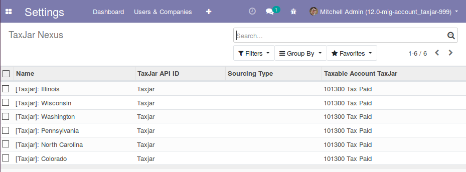
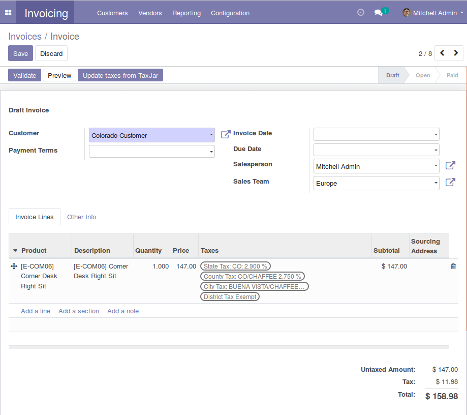

==============
Account TaxJar
==============

This module allow to automate your sales taxes on invoices calculation using
`TaxJar SmartCalcs API <https://www.taxjar.com/smartcalcs/>`_.

This module does:

 * Import/update TaxJar product categories.
 * Import/update TaxJar Nexus.
 * Request for a Tax Rate calculation.

This module does't:

 * Manage transactions with TaxJar Dashboard
 * Manage customers with TaxJar Dashboard
 * Validate addresses

**Table of contents**

.. contents::
   :local:

Configuration
=============

Once module is installed, you need to:

* Configure TaxJar API access on Invoicing > Configuration > TaxJar >
  TaxJar Configuration

* Import/update TaxJar Categories to import Product Tax Category Codes,
  see them on Invoicing > Configuration > TaxJar > TaxJar Categories

* Import/update Taxjar Nexus (ak. Fiscal Position on Odoo) to import Nexus
  you have setup in TaxJar Dashboard, see them on Invoicing > Configuration >
  TaxJar > TaxJar Nexus

** You must configure manually Sourcing Type...
`read more <https://blog.taxjar.com/charging-sales-tax-rates/>`_

Usage
=====

To enable TaxJar tax calculation on specific products, you must:

* Go to Product Form > Invoicing Tab > Select a TaxJar Category.

.. image:: ./static/img/select_taxjar_product_category.png
   :width: 80 %
   :align: center

To use TaxJar tax calculation on a invoice order, let's:

* Go to Invoicing > Sales > Customer Invoice and create an entry.

* You must ensure that selected customer has an associated Fiscal Position
  and this one is a Nexus one, otherwise no TaxJar Calculation will be
  executed.

* Select a Product that has an TaxJar Category associated.

Taxes will automatically generate when Invoice is validated or using
action Update taxes with TaxJar.

Notice that Update taxes with TaxJar action can be performed for multiple
records on a tree view.

Known issues / Roadmap
======================

* Consider Logistic Routes to determine from address jurisditions
* Improve Tax Calculations with onchanges. ¿?
* Move TaxJar Configuration to Settings.

Bug Tracker
===========

Bugs are tracked on `GitHub Issues <https://github.com/OCA/account-financial-tools/issues>`_.
In case of trouble, please check there if your issue has already been reported.
If you spotted it first, help us smashing it by providing a detailed and welcomed
`feedback <https://github.com/OCA/account-financial-tools/issues/new?body=module:%20account_taxjar%0Aversion:%2011.0%0A%0A**Steps%20to%20reproduce**%0A-%20...%0A%0A**Current%20behavior**%0A%0A**Expected%20behavior**>`_.

Do not contact contributors directly about support or help with technical issues.

Credits
=======

Authors
~~~~~~~

* Eficent

Contributors
~~~~~~~~~~~~

* Héctor Villarreal Ortega <hector.villarreal@eficent.com>
